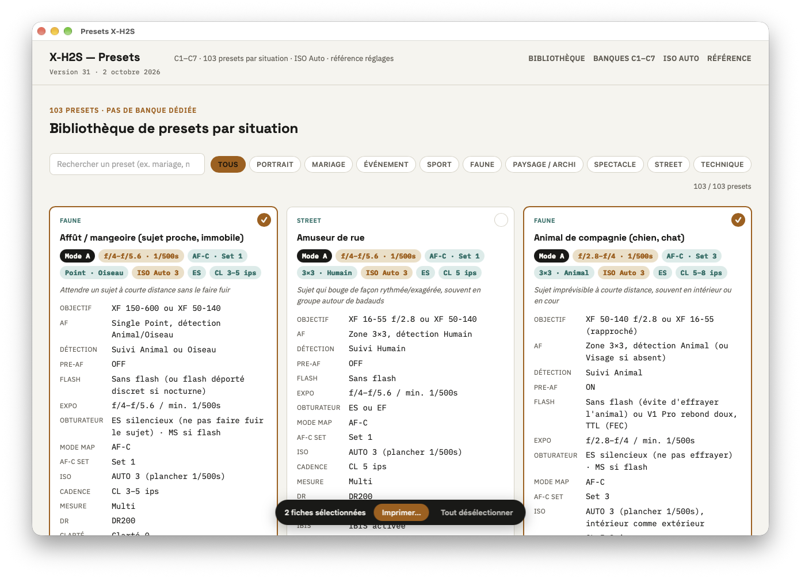
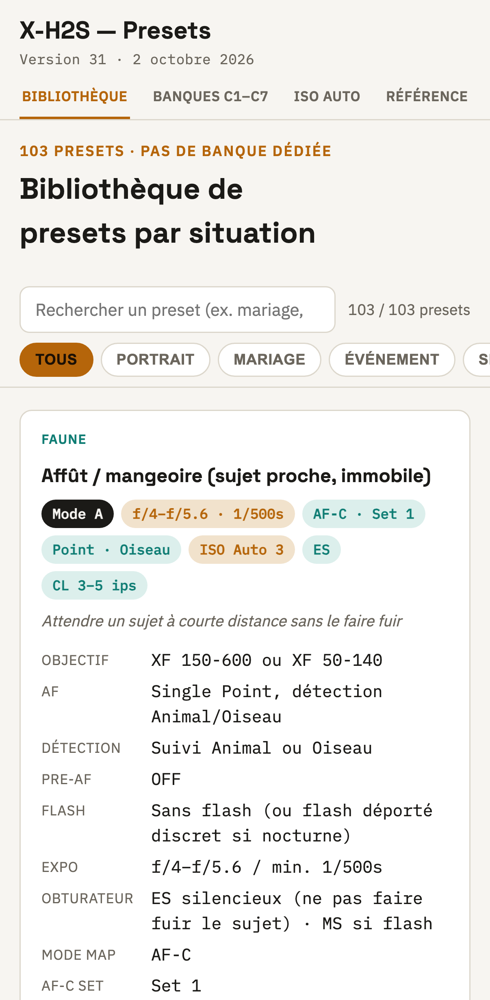
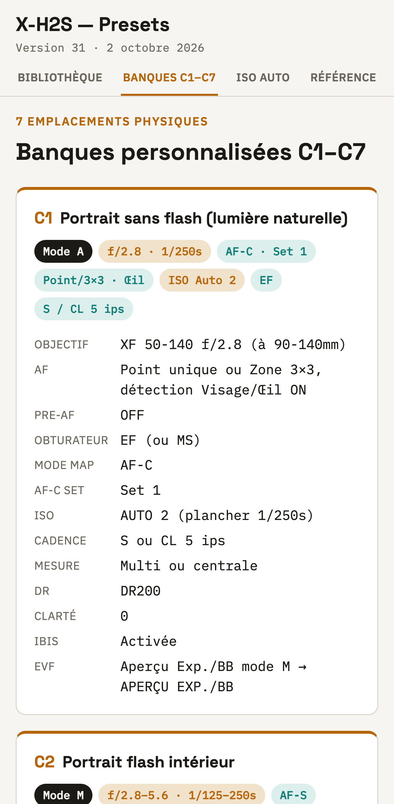

# Presets Fujifilm X-H2S

Référence de terrain pour un Fujifilm X-H2S (firmware 7.3) : banques personnalisées C1–C7, bibliothèque de presets par situation (recherche + filtre par catégorie, tri alphabétique automatique), configuration ISO Auto 1–3 et glossaire des réglages.

La référence existe sous quatre formes : la page `index.html`, l'export Markdown, une [application Mac](#application-mac) qui affiche la page et imprime les fiches choisies, et une [application pour iPhone](#application-iphone) à poser sur l'écran d'accueil.

Parc optique visé : XF 10-24 f/4 R OIS WR II, XF 16-55 f/2.8 R LM WR, XF 50-140 f/2.8 R LM OIS WR, XF 150-600 f/5.6-8 R LM OIS WR, Laowa 60 mm f/2.8 2× Ultra-Macro. Éclairage Godox (V1 Pro, V860II, MF12, AD200, AD600 Pro). Workflow RAW uniquement (Lightroom Classic + DxO PureRAW) : aucun réglage de rendu JPEG (simulations, netteté, grain, DR-P) n'est utilisé.

## Fichiers

| Fichier | Rôle |
|---|---|
| `index.html` | Page autonome (ouvrable localement ou via GitHub Pages). Toutes les données sont dans le tableau `DATA` du `<script>`. |
| `artifact-source.html` | Même contenu sans le squelette `<html>/<body>` — version publiée comme artifact claude.ai. |
| `presets-x-h2s.md` | Export Markdown généré depuis le HTML, pour lecture hors ligne ou impression. |
| `tools/export_md.py` | Script de génération du Markdown (`pip install beautifulsoup4`). |
| `manifest.webmanifest`, `sw.js`, `icons/` | Application web pour iPhone : icône d'écran d'accueil, plein écran, hors-ligne. |
| `app/` | Application macOS native (sources Swift, `build.sh`). Voir [Application Mac](#application-mac). |

## Ajouter ou modifier un preset

1. Dans `index.html` (et `artifact-source.html`), ajouter un objet dans `DATA` en respectant les champs existants : `c` (catégorie), `n` (nom), `g` (objectif), `af`, `d`, `pa`, `fl`, `e`, `i`, `m`, `s`, `sh`, `ib`, `l`, `b1`–`b6`, et `afd` optionnel pour les fiches en MF pur.
2. Le tri alphabétique, les compteurs, la découpe Mesure/DR, IBIS/EVF, Obturateur/Cadence, les lignes Mode MAP / AF-C Set et le nettoyage de la ligne AF sont faits au rendu : rien d'autre à toucher.
3. Régénérer le Markdown : `python3 tools/export_md.py`.
4. Incrémenter la version sous le titre (`
`).

## Conventions

- **ISO Auto** : AUTO 1 = 160–12800, plancher 1/125 s · AUTO 2 = 1/250 s · AUTO 3 = 1/500 s. Le choix de banque ne dépend que du plancher ; au-delà de 1/500 s → mode M, vitesse fixe.
- **DR** : DR100 par défaut, DR200 (ISO ≥ 320) en cas de clipping, DR400 (ISO ≥ 640) exceptionnel. DR-P OFF partout.
- **Obturateur** : ES silencieux sauf flash (MS obligatoire), banding LED (MS + réduction du scintillement) et Bulb (MS/EF).
- **Pre-AF** : ON seulement pour les sujets qui surgissent (sport, faune en action), OFF ailleurs.
- **AF-C Set** : 1 multi-usage · 2 ignorer les obstacles · 3 accélération/décélération · 4 apparition soudaine · 5 erratique · 6 personnalisé.

## Application iPhone

La page s'installe sur l'iPhone comme une application : une icône sur l'écran d'accueil qui ouvre la bibliothèque en plein écran, sans la barre de Safari, et qui fonctionne hors ligne.

  
  &nbsp;&nbsp;
  

*Rendu de la page à la largeur d'un iPhone 17 Pro : l'onglet Bibliothèque, puis l'onglet Banques C1–C7.*

### Installation, étape par étape

1. Sur l'iPhone, ouvrir **Safari** et aller à l'adresse <https://mdany75.github.io/presets-x-h2s/>.
2. Toucher le bouton **Partager** (le carré avec une flèche vers le haut). S'il n'apparaît pas dans la barre de Safari, toucher d'abord le bouton **•••**, puis **Partager**.
3. Faire défiler la liste des actions vers le bas et toucher **Sur l'écran d'accueil**. Si l'action n'est pas dans la liste, toucher **Modifier les actions…** tout en bas pour l'ajouter.
4. Vérifier le nom proposé, « Presets X-H2S ». Si l'option **Ouvrir comme app web** est affichée, la laisser activée.
5. Toucher **Ajouter**, en haut à droite. L'icône (une molette calée sur C1) apparaît sur l'écran d'accueil.
6. Toucher l'icône une première fois **avec du réseau** (Wi-Fi ou cellulaire) et attendre que les fiches s'affichent : c'est cette première ouverture qui enregistre la copie hors ligne.
7. Pour vérifier : activer le mode Avion, fermer l'application, la rouvrir. Les fiches doivent s'afficher normalement.

### Utilisation

- **Onglets** : sur téléphone, le menu du haut affiche une section à la fois — Bibliothèque, Banques C1–C7, ISO Auto, Référence. Chaque onglet retrouve sa position de défilement quand on y revient ; toucher l'onglet déjà affiché remonte en haut. Dans Bibliothèque, la recherche et les catégories restent collées sous les onglets ; la rangée de catégories défile horizontalement.
- **Mise à jour** : rien à faire. À chaque ouverture avec du réseau, l'application recharge la version du dépôt (un push sur `main` suffit) ; le numéro de version est affiché sous le titre. Sans réseau, ou si la réponse tarde plus de 4 s, la copie locale s'affiche.
- **Hors ligne** : la page, l'icône et les polices sont gardées sur l'iPhone par `sw.js`. iOS peut effacer cette copie si l'application n'est pas ouverte pendant plusieurs semaines ; une ouverture avec du réseau la reconstitue.
- **Désinstallation** : appui long sur l'icône, puis **Supprimer l'app**.

### Fichiers concernés

`manifest.webmanifest`, `sw.js`, `icons/` (générées par `app/scripts/make_icon.swift --web icons`) et les blocs « Application web » et « Sur téléphone » du `<head>` de `index.html`. Ces blocs n'existent pas dans `artifact-source.html`, qui n'a pas de `<head>`.

## Publication GitHub Pages

La page est publiée par GitHub Pages depuis la branche `main`, dossier racine : <https://mdany75.github.io/presets-x-h2s/>. Chaque push sur `main` la met à jour en une minute environ.

## Application Mac

`app/` contient une application macOS native (« Presets X-H2S ») qui affiche `index.html` dans sa propre fenêtre.

- Construction et installation dans `/Applications` : `app/build.sh --install` (outils de ligne de commande d'Apple seulement, pas besoin de Xcode).
- La page embarquée est celle du dépôt au moment de la compilation. À chaque lancement, l'application compare sa copie à `index.html` de la branche `main` sur GitHub et télécharge la version plus récente : inutile de recompiler après un changement de fiches, un push suffit. Hors ligne, elle affiche la dernière copie connue.
- Impression : la pastille en haut à droite de chaque fiche (et de chaque banque C1–C7) la sélectionne ; ⌘P ou le bouton « Imprimer… » de la barre du bas imprime la sélection, à quatre fiches par page (une fiche seule est imprimée en pleine largeur). ⇧⌘A sélectionne les fiches que le filtre laisse affichées, ⇧⌘D vide la sélection. La sélection et la mise en page d'impression sont injectées par l'application (`app/Resources/selection.js`) : `index.html` n'est pas modifié.
- Raccourcis : ⌘F recherche un preset, ⌘R force la mise à jour depuis GitHub, ⌘+ / ⌘- / ⌘0 règlent le zoom.
