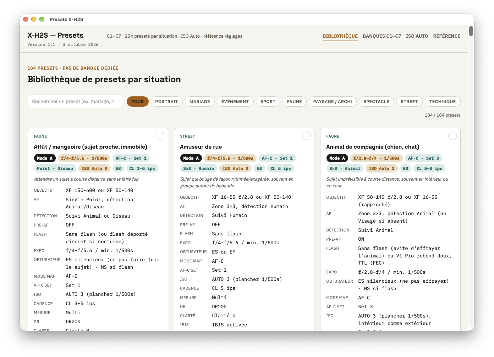
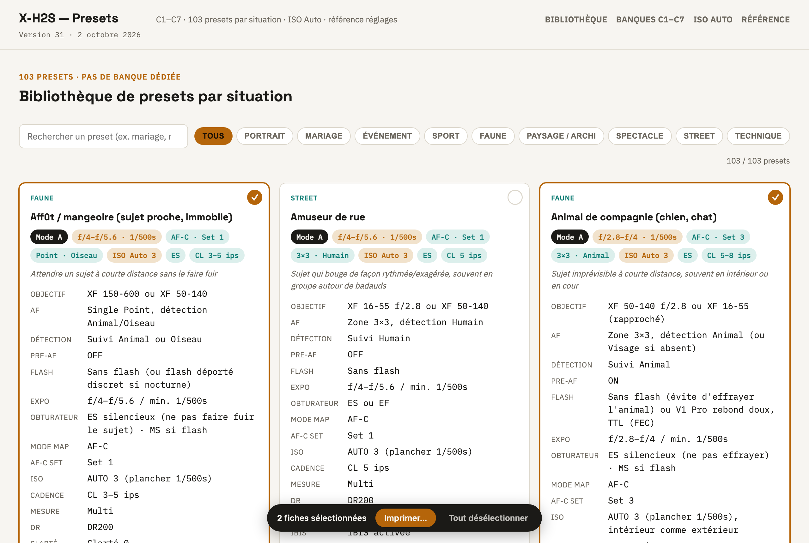
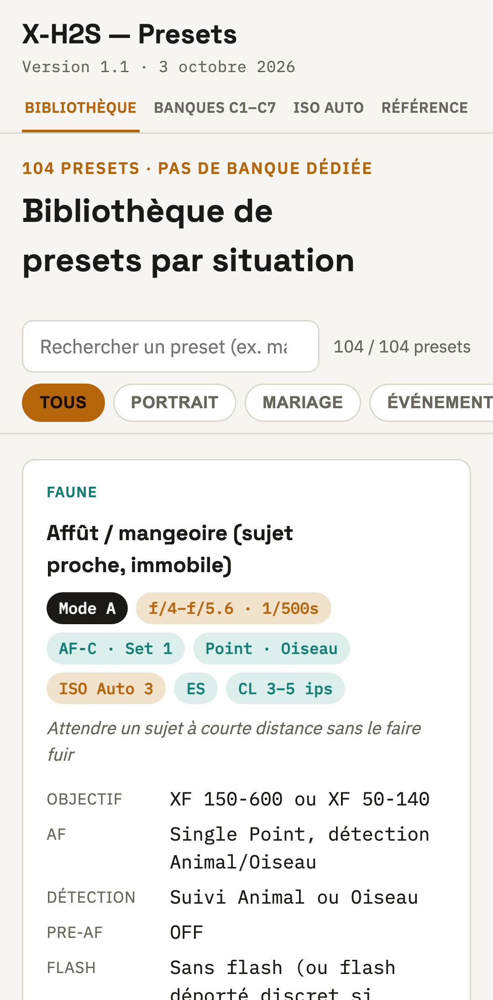
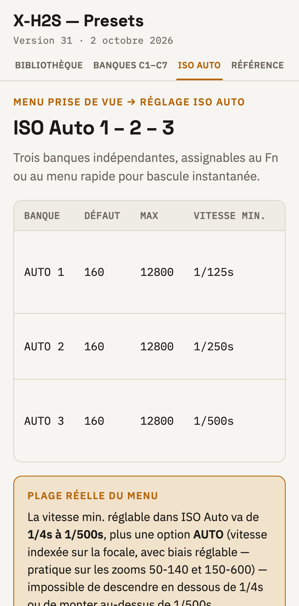

# Presets Fujifilm X-H2S

Référence de terrain pour un Fujifilm X-H2S (firmware 7.3) : banques personnalisées C1–C7, bibliothèque de presets par situation, configuration ISO Auto 1–3 et glossaire des réglages. Pour un photographe qui travaille en RAW et veut retrouver ses réglages sur le terrain, sur Mac, PC, iPhone ou Android.



## Fonctions

- 104 fiches de presets classées par situation (portrait, mariage, événement, sport, faune, paysage, spectacle, street, technique), avec recherche instantanée et filtre par catégorie.
- Les sept banques personnalisées C1–C7 du boîtier, détaillées réglage par réglage.
- Les trois banques ISO Auto et le glossaire des réglages (AF-C Set, DR, obturateur, EVF…).
- Une section à la fois : Bibliothèque, Banques C1–C7, ISO Auto et Référence sont des onglets ; chacun retrouve sa position de défilement.
- La même référence sur quatre appareils : application Mac native, application web installable sur PC Windows, iPhone et Android (icône, plein écran, hors ligne).
- Mise à jour automatique : chaque fiche ajoutée au dépôt apparaît dans les quatre applications à leur prochaine ouverture avec du réseau.
- Impression de fiches choisies (Mac et PC) : on coche les fiches, elles sortent à quatre par page ; une fiche seule en pleine largeur.
- Aucun réglage de rendu JPEG : la référence suppose un flux RAW (Lightroom Classic + DxO PureRAW).

| | Mac | PC Windows | iPhone | Android (Samsung) |
|---|---|---|---|---|
| Nature | Application native (Swift) | Application web installée par Edge ou Chrome | Application web posée sur l'écran d'accueil | Application web installée par Chrome ou Samsung Internet |
| Installation | Image disque `.dmg` à glisser dans Applications | Depuis le navigateur, en trois clics | Safari : Partager → Sur l'écran d'accueil | Chrome : ⋮ → Ajouter à l'écran d'accueil |
| Où la trouver ensuite | Dossier Applications, Dock | Menu Démarrer, barre des tâches, Bureau | Écran d'accueil | Écran d'accueil, liste des applications |
| Hors ligne | Oui | Oui, après une première ouverture | Oui, après une première ouverture | Oui, après une première ouverture |
| Impression de fiches choisies | Oui, quatre par page | Oui, quatre par page | Non | Non |
| Affichage | Onglets | Onglets | Onglets, en-tête compact | Onglets, en-tête compact |

Adresse de l'application web : <https://mdany75.github.io/presets-x-h2s/>

## Installer

### Mac

Télécharge [Presets-X-H2S.dmg](https://github.com/mdany75/presets-x-h2s/releases/latest/download/Presets-X-H2S.dmg) (toujours la dernière version), puis :

1. Ouvre le fichier téléchargé : une fenêtre montre l'application et un raccourci vers le dossier Applications.
2. Glisse **Presets X-H2S** sur **Applications**, puis éjecte le disque « Presets X-H2S ».
3. Ouvre **Presets X-H2S** depuis le dossier Applications. Au premier lancement, macOS affiche qu'il n'a pas pu vérifier l'application : clique sur **Terminé**.
4. Ouvre **Réglages Système** → **Confidentialité et sécurité**, descends jusqu'à la section **Sécurité** : à côté du message « Presets X-H2S a été bloqué », clique sur **Ouvrir quand même**, puis confirme avec le mot de passe ou Touch ID.
5. L'application s'ouvre. Les lancements suivants se font normalement.

Configuration requise : macOS 14 ou plus récent, Mac Apple Silicon ou Intel. Les étapes 3 et 4 ne sont demandées qu'une fois : l'application est signée localement, pas notariée par Apple. Équivalent dans le Terminal :

```bash
xattr -dr com.apple.quarantine "/Applications/Presets X-H2S.app"
```

À l'usage :

- **Impression** : la pastille en haut à droite de chaque fiche (et de chaque banque C1–C7) la sélectionne. ⌘P, ou le bouton « Imprimer… » de la barre du bas, imprime la sélection à quatre fiches par page. ⇧⌘A sélectionne les fiches que le filtre laisse affichées, ⇧⌘D vide la sélection.
- **Mise à jour** : rien à faire. À chaque lancement, l'application compare sa copie à `index.html` de la branche `main` et télécharge la version plus récente. Hors ligne, elle affiche la dernière copie connue.
- **Raccourcis** : ⌘F ouvre l'onglet Bibliothèque et place le curseur dans la recherche, ⌘R force la mise à jour depuis GitHub, ⌘+ / ⌘- / ⌘0 règlent le zoom.
- **Désinstallation** : glisser l'application du dossier Applications vers la corbeille.

### PC Windows



*Rendu de l'application à la taille d'une fenêtre de PC, dans le moteur d'Edge et de Chrome.*

Avec **Microsoft Edge** (installé sur tous les PC Windows) :

1. Ouvrir Edge et aller à l'adresse <https://mdany75.github.io/presets-x-h2s/>.
2. Cliquer sur le menu **…** en haut à droite, puis **Applications**, puis **Installer ce site en tant qu'application**.
3. Garder le nom proposé, « Presets X-H2S », et cliquer sur **Installer**.
4. Dans la fenêtre qui s'ouvre, cocher les raccourcis voulus — **Épingler à la barre des tâches**, **Épingler au menu Démarrer**, **Créer un raccourci sur le Bureau** — puis **Autoriser**.
5. Laisser l'application ouverte quelques secondes avec du réseau : cette première ouverture enregistre la copie hors ligne.

Avec **Google Chrome** :

1. Ouvrir Chrome et aller à l'adresse <https://mdany75.github.io/presets-x-h2s/>.
2. Cliquer sur l'icône d'installation à droite de la barre d'adresse (un écran avec une flèche vers le bas). Si elle n'apparaît pas, cliquer sur le menu **⋮** en haut à droite, puis **Caster, enregistrer et partager**, puis **Installer la page en tant qu'application…**.
3. Dans la fenêtre « Installer l'application ? », cliquer sur **Installer**. L'application s'ouvre dans sa propre fenêtre ; Chrome l'ajoute au menu Démarrer et crée un raccourci sur le Bureau.
4. Pour la garder dans la barre des tâches : clic droit sur son icône dans la barre des tâches, puis **Épingler à la barre des tâches**.
5. Laisser l'application ouverte quelques secondes avec du réseau : cette première ouverture enregistre la copie hors ligne.

Les libellés exacts des menus peuvent varier d'une version du navigateur à l'autre.

À l'usage : l'impression fonctionne comme sur Mac (pastille, bouton « Imprimer… » ; **Ctrl+P** imprime la sélection s'il y en a une, sinon l'onglet affiché) ; la mise à jour est automatique à chaque ouverture avec du réseau. Désinstallation : dans la fenêtre de l'application, menu **…** → **Paramètres de l'application** → **Désinstaller** (Edge) ou menu **⋮** → **Désinstaller Presets X-H2S…** (Chrome). La même installation fonctionne sur Mac et Linux avec Edge ou Chrome.

### iPhone

<p>
  
  &nbsp;&nbsp;
  
</p>

*Rendu de la page à la largeur d'un iPhone 17 Pro : l'onglet Bibliothèque, puis l'onglet Banques C1–C7.*


1. Sur l'iPhone, ouvrir **Safari** et aller à l'adresse <https://mdany75.github.io/presets-x-h2s/>.
2. Toucher le bouton **Partager** (le carré avec une flèche vers le haut). S'il n'apparaît pas dans la barre de Safari, toucher d'abord le bouton **•••**, puis **Partager**.
3. Faire défiler la liste des actions vers le bas et toucher **Sur l'écran d'accueil**. Si l'action n'est pas dans la liste, toucher **Modifier les actions…** tout en bas pour l'ajouter.
4. Vérifier le nom proposé, « Presets X-H2S ». Si l'option **Ouvrir comme app web** est affichée, la laisser activée.
5. Toucher **Ajouter**, en haut à droite. L'icône (une molette calée sur C1) apparaît sur l'écran d'accueil.
6. Toucher l'icône une première fois **avec du réseau** (Wi-Fi ou cellulaire) et attendre que les fiches s'affichent : c'est cette première ouverture qui enregistre la copie hors ligne.
7. Pour vérifier : activer le mode Avion, fermer l'application, la rouvrir. Les fiches doivent s'afficher normalement.

À l'usage : les onglets tiennent sur une ligne sous le titre ; dans Bibliothèque, la recherche et les catégories restent collées sous les onglets, et la rangée de catégories défile horizontalement. La mise à jour est automatique à chaque ouverture avec du réseau ; sans réseau, ou si la réponse tarde plus de 4 s, la copie locale s'affiche. iOS peut effacer cette copie si l'application n'est pas ouverte pendant plusieurs semaines ; une ouverture avec du réseau la reconstitue. Désinstallation : appui long sur l'icône, puis **Supprimer l'app**.

### Android (Samsung)

<p>
  
  &nbsp;&nbsp;
  
</p>

*Rendu de la page à la largeur d'un Samsung Galaxy S (360 points) : l'onglet Bibliothèque, puis l'onglet ISO Auto.*

Avec **Google Chrome** :

1. Sur le téléphone, ouvrir **Chrome** et aller à l'adresse <https://mdany75.github.io/presets-x-h2s/>.
2. Toucher le menu **⋮** en haut à droite.
3. Toucher **Ajouter à l'écran d'accueil** (selon la version : **Installer l'application**).
4. Choisir **Installer**, puis confirmer avec **Installer**.
5. L'icône apparaît sur l'écran d'accueil et dans la liste des applications. L'ouvrir une première fois **avec du réseau** et attendre que les fiches s'affichent : cette première ouverture enregistre la copie hors ligne.
6. Pour vérifier : activer le mode Avion, fermer l'application, la rouvrir.

Avec **Samsung Internet** :

1. Ouvrir **Samsung Internet** et aller à l'adresse <https://mdany75.github.io/presets-x-h2s/>.
2. Toucher l'icône d'installation dans la barre d'adresse (une flèche vers le bas), si elle est affichée. Sinon, toucher le menu **≡** en bas à droite, puis **Ajouter à** (ou **Ajouter la page à**), puis **Écran d'accueil**.
3. Confirmer avec **Installer** ou **Ajouter**.
4. Ouvrir l'icône une première fois avec du réseau, comme à l'étape 5 ci-dessus.

Les libellés exacts des menus peuvent varier selon la version d'Android, de One UI et du navigateur. À l'usage, tout est comme sur l'iPhone ; désinstallation : appui long sur l'icône, puis **Désinstaller**.

## Reconstruire

Outils nécessaires : les outils de ligne de commande d'Apple (`xcode-select --install`), pas Xcode. Pour l'export Markdown, Python 3 avec `beautifulsoup4` dans un environnement local : `python3 -m venv .venv && .venv/bin/pip install beautifulsoup4`.

```bash
./build.sh
```

Produit `build/Presets-X-H2S.dmg` : l'application Mac, universelle (Apple Silicon et Intel), signée localement, avec la page du dépôt embarquée. `./build.sh --install` l'installe en plus dans `/Applications` et l'ouvre. Une application construite sur place n'est pas bloquée au premier lancement.

```bash
.venv/bin/python scripts/export_md.py
```

Produit `build/presets-x-h2s.md`, l'export Markdown de la bibliothèque (lecture hors ligne, impression). Il est joint à chaque Release.

Les icônes de l'application web se régénèrent avec `swiftc -swift-version 5 scripts/make_icon.swift -o build/make_icon && build/make_icon --web icons`.

## Organisation

| Dossier ou fichier | Rôle |
|---|---|
| `index.html` | La page, servie par GitHub Pages et embarquée dans l'application Mac. Toutes les données sont dans le tableau `DATA` du `<script>`. Son `<head>` porte ce qui est propre aux applications : installation, hors-ligne, onglets, en-tête compact du téléphone, chargement de `selection.js` sur ordinateur. |
| `selection.js` | Sélection et impression de fiches, partagé par la version PC (chargé par la page) et la version Mac (injecté par l'application). |
| `manifest.webmanifest`, `sw.js`, `icons/` | Application web (PC, iPhone et Android) : nom, icônes, fonctionnement hors ligne. |
| `Sources/`, `Resources/` | Code Swift et `Info.plist` de l'application Mac. |
| `build.sh` | Construit l'application Mac et son image disque dans `build/`. |
| `scripts/` | `export_md.py` (export Markdown), `make_icon.swift` (icônes Mac et web). |
| `docs/` | Captures d'écran du README. |
| `build/` | Tout ce qui est produit ; ignoré par git. Les fichiers à distribuer vont dans une Release GitHub. |
| `CHANGELOG.md`, `CLAUDE.md` | Historique des versions ; règles du projet pour Claude Code. |

### Ajouter ou modifier un preset

1. Dans `index.html`, ajouter un objet dans `DATA` en respectant les champs existants : `c` (catégorie), `n` (nom), `g` (objectif), `af`, `d`, `pa`, `fl`, `e`, `i`, `m`, `s`, `sh`, `ib`, `l`, `b1`–`b6`, et `afd` optionnel pour les fiches en MF pur.
2. Le tri alphabétique, les compteurs, la découpe Mesure/DR, IBIS/EVF, Obturateur/Cadence, les lignes Mode MAP / AF-C Set et le nettoyage de la ligne AF sont faits au rendu : rien d'autre à toucher.
3. Mettre à jour la date sous le titre (`<div class="ver">Version 1.1 · date</div>`). Le numéro de version ne change pas à chaque fiche.
4. Pousser sur `main` : GitHub Pages republie la page en une minute environ, et les quatre applications la récupèrent à leur prochaine ouverture.

### Conventions de réglages

Parc optique visé : XF 10-24 f/4 R OIS WR II, XF 16-55 f/2.8 R LM WR, XF 50-140 f/2.8 R LM OIS WR, XF 150-600 f/5.6-8 R LM OIS WR, Laowa 60 mm f/2.8 2× Ultra-Macro. Éclairage Godox (V1 Pro, V860II, MF12, AD200, AD600 Pro). Workflow RAW uniquement (Lightroom Classic + DxO PureRAW) : aucun réglage de rendu JPEG (simulations, netteté, grain, DR-P) n'est utilisé.

- **ISO Auto** : AUTO 1 = 160–12800, plancher 1/125 s · AUTO 2 = 1/250 s · AUTO 3 = 1/500 s. Le choix de banque ne dépend que du plancher ; au-delà de 1/500 s → mode M, vitesse fixe.
- **DR** : DR100 par défaut, DR200 (ISO ≥ 320) en cas de clipping, DR400 (ISO ≥ 640) exceptionnel. DR-P OFF partout.
- **Obturateur** : ES silencieux sauf flash (MS obligatoire), banding LED (MS + réduction du scintillement) et Bulb (MS/EF).
- **Pre-AF** : ON seulement pour les sujets qui surgissent (sport, faune en action), OFF ailleurs.
- **AF-C Set** : 1 multi-usage · 2 ignorer les obstacles · 3 accélération/décélération · 4 apparition soudaine · 5 erratique · 6 personnalisé.

### Publication GitHub Pages

La page est publiée depuis la branche `main`, dossier racine : <https://mdany75.github.io/presets-x-h2s/>.
